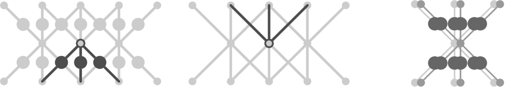

<h1 align="center">
  
</h1>

# boolearn

<!--
<p align="center">
  
</p>
-->

**boolearn** is a lightweight C toolkit for training **boolnets**  — networks of **Boolean threshold functions**.

Since Boolean threshold functions have ±1 outputs, boolnets cannot be trained by gradient-descent (back-propagation).

The training algorithm in boolearn is based on **constraints** and **projections** to these constraints.

Using **divide-and-concur**, the constraints fall into sets *A* and *B* that each have easy projections. A trained network is a point that lies in both *A* and *B*.

Instead of minimizing a loss, boolearn minimizes the distance between pairs of points in *A* and *B* ("the gap"). Training is complete when this distance is zero.

For details, see *Learning with Boolean threshold functions* (*LWBTF*) by Elser & Lal.

**Note:** boolearn is research software and intentionally CLI-first.

## Quickstart

Build the tools:

```bash
cd boolearn/src
make all
```

Run the smallest tutorial example (2-bit multiplier):

```bash
cd ../mult

# generate a layered network from a width file
../src/layered 2x2.wth 2x2.net

# train
../src/train 2x2.net 2x2.dat 16 3. .2 1e-3 10 1e4 .01 5 2x2a
```

This produces `2x2a.cmd`, `2x2a.gap`, `2x2a.run`, `2x2a.sol` in the current diectory. 

### Width files

These start with the number of layers, followed by the width of each layer (input to output). Here is `2x2.wth` :

```
3
4 4 4 4
```

### Network files

The header lists `number of nodes`, `number of input nodes`, `number of output nodes`, and `number of edges`. This is followed by a list of edges in the form:

`receiving node`  `sending node`  `weight`

Here is the top of `2x2.net`:

```
17  5  4  60
    5    0    0.00000000
    5    1    0.00000000
    5    2    0.00000000
    5    3    0.00000000
    5    4    0.00000000
    6    0    0.00000000
    6    1    0.00000000
    6    2    0.00000000
    6    3    0.00000000
    6    4    0.00000000

    ...
```

Node 0 is the constant-input node (not included in the count of input nodes) with value -1. The weights are all zero because the network has not been trained. The file `2x2a.sol` produced by `train` replaces these with the weights of the trained network:

```
17  5  4  60
    5    0    1.28963089
    5    1   -0.01003229
    5    2    1.29350000
    5    3   -0.01789875
    5    4    1.28968558
    6    0   -0.00669030
    6    1   -0.00508804
    6    2   -1.29501533
    6    3   -1.28961000
    6    4   -1.28832088

    ...
```

### Data files

The first line of the header gives the number of data items, the second/third lines the `type` and `number` of input/output data. Here is the top of `2x2.dat`:


```
16
2 4
2 4

1 0 0 1
0 0 1 0

0 1 1 0
0 0 1 0

...
```

In the first data item `1 0 0 1` represents the input `2 x 1` and `0 0 1 0` is the desired output `= 2`. The second input/output pair is the fact `1 x 2 = 2`.

Here are the codes for input `type` :

`2` Boolean (0 or 1)

`0` analog (numbers between 0 and 1)

In generative models there is no input and `number` is given as zero. But there are two choices for `type`:

`1  0`  1-hot input 

`2  0`  hypercube input

In both cases the data items just have an output vector. The length of the input 1-hot or input binary-code is set by the first width in the width file.


When `number` in the output data type equals 1 the network is trained to output 1-hot vectors, as in classification. For example, here is the header of `mnistjr.dat`:

```
3823
0	64
10	1
```

There are 3823 data. The second line tells us these are analog (0) and 64 in number, and the third line tells the network to output 1-hot vectors of length 10.


## What are the command-line arguments?

Here is the command line we used for training the 2-bit multiplier and the meaning of the arguments:

```
../src/train 2x2.net 2x2.dat 16 3. .2 1e-3 10 1e4 .01 5 2x2a
```

`2x2.net`  — network file of the model

`2x2.dat`  — data file

`16`  — number of data to be used for training

`3.`  — support parameter (sigma)

`.2`  — time step parameter (beta)

`1e-3`  — metric relaxation parameter (gamma)

`10`  — maximum number of lines/checkpoints in `2x2a.gap` (gap output file)

`1e4`  — maximum number of iterations of the RRR constraint solver

`.01`  — stop when gap reaches this value

`5`  — number of runs from different random starts

`2x2a`  — identifier used on all output files

### The run file

The file `2x2a.run` is a summary of the runs:

```
   1           0    0.25345028    95.312 %     0.000 %
   2        4720    0.00990648   100.000 %     0.000 %
   3           0    0.18963460    98.438 %     0.000 %
   4        4215    0.00997302   100.000 %     0.000 %
   5        1748    0.00996164   100.000 %     0.000 %

3 / 5 solutions   3561.000000 +/- 749.664073 iterations/solution
```
For each run are listed the number of `iterations` (0 if unsuccessful), `final gap` value, `final train accuracy`, and `final test accuracy`. The test accuracies are zero because we trained on all the data.

An easy way to tune hyperparameters is to run the same command line with one of them (`beta`, `gamma`) changed and with a different identifier (`2x2b`). The command line of the original run was preserved in `2x2a.cmd`.

### The gap file

Here is `2x2a.gap` :

```
         3    0.63730746    0.51068437    0.59767524    1.90330498    1.90330498    39.062 %     0.000 %
         7    0.28709332    0.39583726    0.47766155    1.18781516    1.18781516    42.188 %     0.000 %
        16    0.15418314    0.32910321    0.37599194    0.91531517    0.91531517    48.438 %     0.000 %
        40    0.11333764    0.17912177    0.28015531    0.55363981    0.54429541    75.000 %     0.000 %
       101    0.09224390    0.13013280    0.22288098    0.43946277    0.31284609    92.188 %     0.000 %
       252    0.05145099    0.09696187    0.11252093    0.27659330    0.22704789    89.062 %     0.000 %
       631    0.04410824    0.07337718    0.06960706    0.20438749    0.14638871    96.875 %     0.000 %
      1585    0.00418919    0.00395415    0.00736747    0.01338425    0.01140373   100.000 %     0.000 %
      1748    0.00358262    0.00245104    0.00541364    0.00996164    0.00996164   100.000 %     0.000 %
```
Each line is a checkpoint in the final run. Checkpoints are exponentially spaced. All the plots in *LWBTF* are derived from the 1st column (`iterations`), 5th column (`gap`), 6th column (`min-gap`), 7th column (`train accuracy`), and the 8th column (`test accuracy`). Columns 2-4 break down the contributions to the gap from the `w`, `x`, and `y` variables.


## How do I generate synthetic data?

*LWBTF* features three kinds of synthetic data created with programs in **boolearn**:

### Random logic circuits 

`layered_andor` and `layered_maj` are like the program `layered` except that the weights are given nonzero values that correspond to random logic circuits (as described in *LWBTF*). The 5-layered random And/Or circuit network `a5.net` was created with the command line
```bash
cd ../randlogic

../src/layered_andor .5 5.wth a5.net
```
The value `.5` for the first argument is the probability of having a node act as an And/Or gate instead of Copy. Here is the `5.wth` used in *LWBTF* :
```
5
32 32 32 32 32 32
```
The random majority gate network `m5.net` was created in the same way but with the program `layered_maj`.

After creating the networks (with sparse weights), the synthetic data is generated with this command line:
```
../src/data a5.net dummy 10000 a5
```
This generates `10000` data items by feeding random Boolean inputs into `a5.net`. The name of the data file is the last argument with `.dat` appended. The argument `dummy` is ignored unless the number of data items is zero (see below).

### Cellular automata

Use the command
```bash
cd ../cellauto

../src/data_cellauto 3 30 16 2 10000 30_2
```
to generate `10000` data items for `2` steps of Wolfram's `3`-bit rule-`30` automaton on a periodic world of size `16`. Here is the top of `30_2.dat` :
```
10000
2 16
2 16

 1 0 1 0 0 1 0 1 0 1 0 0 1 1 1 1
 0 1 1 0 0 0 0 1 0 1 0 0 0 1 0 0

 1 1 0 0 0 0 1 0 1 0 0 0 1 1 0 0
 0 0 1 1 1 1 0 0 1 0 0 1 0 0 1 0

 ...
```

## How do I generate data from a generative model?

We'll use the MNIST 4's as an example. Here's the top of `mnist4.dat` :
```
5842
1 0
2 256

0 0 0 0 0 0 0 0 0 0 0 0 1 1 1 0 0 0 0 0 0 0 0 0 0 0 0 0 1 1 0 0 0 0 0 0 0 0 0 1 0 0 0 1 1 1 0 0 ...
```
There are `5842` Boolean output vectors of length `256` and no input vectors. The `1 0` means the generators should be 1-hot. As in *LWBTF* we can create a generative model with `16` generators by using an architecture specified by width file `16a.wth` :
```
2
16 256 256
```
The first width is the number of 1-hot generators. We create the network as in the other examples:
```bash
cd ../decode

../src/layered 16a.wth 16a.net
```
Here is the command line for training:
```
../src/train 16a.net mnist4.dat 1024 5. .2 1e-3 200 2e4 .01 1 16a
```
We are training on just `1024` data items. Because of the `1 0` in `mnist4.dat`, the program `train` creates a **generator file** in addition to all the others. Here is `16a.gen` :
```
16  16

 1 0 0 0 0 0 0 0 0 0 0 0 0 0 0 0	23
 0 1 0 0 0 0 0 0 0 0 0 0 0 0 0 0	94
 0 0 1 0 0 0 0 0 0 0 0 0 0 0 0 0	99
 0 0 0 1 0 0 0 0 0 0 0 0 0 0 0 0	46
 0 0 0 0 1 0 0 0 0 0 0 0 0 0 0 0	76
 0 0 0 0 0 1 0 0 0 0 0 0 0 0 0 0	71
 0 0 0 0 0 0 1 0 0 0 0 0 0 0 0 0	77
 0 0 0 0 0 0 0 1 0 0 0 0 0 0 0 0	36
 0 0 0 0 0 0 0 0 1 0 0 0 0 0 0 0	43
 0 0 0 0 0 0 0 0 0 1 0 0 0 0 0 0	47
 0 0 0 0 0 0 0 0 0 0 1 0 0 0 0 0	75
 0 0 0 0 0 0 0 0 0 0 0 1 0 0 0 0	94
 0 0 0 0 0 0 0 0 0 0 0 0 1 0 0 0	46
 0 0 0 0 0 0 0 0 0 0 0 0 0 1 0 0	68
 0 0 0 0 0 0 0 0 0 0 0 0 0 0 1 0	38
 0 0 0 0 0 0 0 0 0 0 0 0 0 0 0 1	91
```
`16 16` in the header means there are 16 generators and all of them (16) were used. What follows is a list of the generators (all 1-hot) and how many times each one was used.

Here's how the program `data` is used to generate the trained model's MNIST 4's:
```
../src/data 16a.sol 16a.gen 0 16a
```
Because of the `0` in the slot for the number of data items, the file `16a.gen` is used for the network inputs. The resulting data file `16a.dat` will just have 16 items because `16a.gen` has 16 generators. In the first argument of the program `data` it's important to use the network file of the trained model, `16a.sol`, and not the network file `16a.net` created by `layered`.


<!--

##


 Mental model 

- `*.dat` — datasets (booleans encoded as ±1)
- `*.net` — network graphs + weights
- `layered` — generates a fully connected layered boolnet from a `*.wth` file
- `train` — runs constraint satisfaction and writes a `*.gap` log you can watch

## Documentation

- Start here → [docs/README.md](docs/README.md)
- Applications → [docs/applications/](docs/applications/)

## Data

Datasets live under [data/](data/) (see [data/README.md](data/README.md)).

-->
