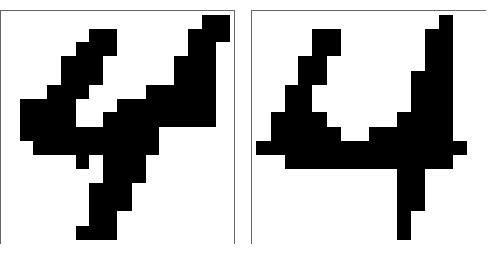

# Boolearn




Boolearn is a small C toolkit for training and testing **boolnets** — networks of Boolean threshold functions — using **constraint projections**. Progress is measured with a **gap** (constraint violation) rather than a typical ML-style loss.

The workflow is intentionally CLI-first: build a few Unix-style tools, then run them from the example folders.

## Quickstart

Build the tools:

```bash
cd boolearn/src
make all
```

Run the smallest tutorial example (2-bit multiplier):

```bash
cd ../mult

# generate a layered network from a width file
../src/layered 0.5 2x2.wth 2x2.net

# train
../src/train 2x2.net 2x2.dat 16 3 0.2 1e-3 10 1e4 0.01 1 run1
```

This produces `run1.cmd`, `run1.gap`, `run1.run`, `run1.sol` in the current folder.

## Mental model

- `*.dat` — datasets (booleans encoded as ±1)
- `*.net` — network graphs + weights
- `layered` — generates a fully connected layered boolnet from a `*.wth` file
- `train` — runs constraint satisfaction and writes a `*.gap` log you can watch

## Documentation

- Start here → [docs/README.md](docs/README.md)
- Applications (verbatim sections from the original guide) → [docs/applications/](docs/applications/)
- Original monolithic guide → [docs/legacy/USER_GUIDE_ORIGINAL.md](docs/legacy/USER_GUIDE_ORIGINAL.md)

## Data

Datasets live under [data/](data/) (see [data/README.md](data/README.md)).
