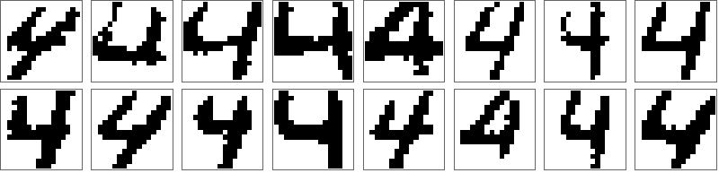

## Decoding and generative models

The decoder-half of an autoencoder is a primitive *generative model* : from just a few bits of input, arbitrarily complex (perhaps even interesting!) data vectors (text, images) can be conjured up. As a warm-up, we'll try `train` on some small random vectors, like those in the autoencoder experiments. After some experience with that, we'll move on to some images of the number 4 from the internet.

In the directory `decode` you will find the file `rand16.dat`:
```
16
2 0
2 16

0 0 0 0 1 0 0 1 1 1 1 1 1 1 0 1

0 0 1 1 0 0 1 1 0 1 1 0 1 0 0 1

etc.
```
Shown above are just two of the 16 data items (random vectors). The `2 0` and `2 16` in the header tells `train` there is no data to constrain the network inputs and there are 16 binary data that constrain the outputs (the random vectors). Thanks to the constraint formulation, `train` can work with missing inputs in much the same way it works with known inputs. For the $A$ constraint, instead of projecting node variables $y$ at the input nodes to known values ($-1$ or $+1$), the projection replaces each $y$ by *either* $-1$ or $+1$, whichever is closer (has the shorter projection distance). Everything else (projections to all the BTF constraints, concur) is unchanged.

Recalling what we found in the autoencoder experiments, it should be possible to construct a boolnet that decodes 4 bits into 16 random vectors with the following layered architecture:
```
2
4 16 16
```
Using the `rand16.net` constructed by `layered` with this width file, we run `train` as in the other examples:
```
./../src/train rand16.net rand16.dat 16 3. .5 1e-4 10 1e6 .01 1 rand16 &
```
Here is `rand16.gap`:
```
         4    0.13575713    0.22147336    0.68988313    1.08057431    1.08057431     0.000 %     0.000 %
        16    0.10156869    0.19300126    0.59327046    0.91103500    0.91103500     0.000 %     0.000 %
        64    0.07241161    0.11791873    0.46760830    0.64507023    0.61210050     0.000 %     0.000 %
       252    0.04127719    0.05865468    0.24503162    0.32627824    0.32627824     0.000 %     0.000 %
      1001    0.03505607    0.05050834    0.13844674    0.24742913    0.20913804     0.000 %     0.000 %
      3982    0.04201491    0.06611897    0.15508586    0.30804065    0.15949651     0.000 %     0.000 %
     15849    0.03484822    0.05317678    0.09555559    0.23383975    0.15949651     0.000 %     0.000 %
     63096    0.03416997    0.05492065    0.12664713    0.24905679    0.14358508     0.000 %     0.000 %
     76136    0.00183625    0.00168834    0.00602704    0.00998458    0.00998458     0.000 %     0.000 %
```
The small final gap leaves no doubt that a true decoder network has been found, even when that can't be confirmed by the accuracies (rightmost columns) when there is no input data. However, `train` provides a check by writing generator files when there is no input data. Because we used `rand16` for `id`, the generator file is `rand16.gen`. Here is how it begins:
```
16  4

 0 0 0 0	1
 1 0 0 0	1
 0 1 0 0	1
 1 1 0 0	1
 0 0 1 0	1

etc.
```
Since our network architecture specified 4 input/code bits, each line has a binary assignment to those bits. This is followed by the number of times the assignment was used in generating the data. Because the data comprised $2^4$ distinct vectors, all $2^4$ assignments had to be used (exactly once). `train` lists them as increasing binary numbers.

The most direct way to check our decoder is with the synthetic data generating program `data`. Here is what we get when we query its arguments:
```
./../src/data
expected 4 arguments: netfile genfile items id
```
For `netfile` we should *not* use `rand16.net`, since `layered` created that file with random weights (that did not get used by `train`). Instead, we should use `rand16.sol`: the same network but with solution weights. The next argument for `data` is the generator file that goes with the solution, `rand16.gen`. The argument `items` is needed when we want `data` to generate synthetic data (`items` in number) by sampling random inputs. Since here the file `rand16.gen` provides all the inputs, we tell `data` to use that instead with the setting 0 for this argument. The command
```
./../src/data rand16.sol rand16.gen 0 rand16+inputs
```
creates the data file `rand16+inputs.dat` :
```
16
2 4
2 16

 0 0 0 0
 0 0 0 0 1 0 0 0 1 0 1 1 0 1 0 1

 1 0 0 0
 1 0 0 1 1 1 0 1 1 1 0 1 1 0 1 0

 0 1 0 0
 1 1 1 1 1 1 0 1 1 1 1 1 0 0 1 1

 1 1 0 0
 1 1 1 0 1 1 0 1 1 0 0 0 1 0 1 1

 0 0 1 0
 0 0 0 0 1 0 0 1 1 1 1 1 1 1 0 1

etc.
```
All the random vectors of `rand16.dat` appear somewhere in the list, now preceded by the decoder inputs. In generative models the symmetries that previously only applied to the hidden nodes also apply to the input nodes. That explains why the first random vector of `rand16.dat` can end up as the 5th item in `rand16+inputs.dat`.

In `decode` you will find another data file, `mnist4.dat`, the top of which looks like this:
```
5842
1 0
2 256

0 0 0 0 0 0 0 0 0 0 0 0 1 1 1 0 0 0 0 0 0 0 0 0 0 0 0 0 1 1 0 0 0 0 0 0 0 0 0 1 0 ...

etc.
```

The input-type specification `1 0` is different from the `2 0` of `rand16.dat`. While `0` continues to mean "zero input data", the `1` means only "1-hot" inputs will be considered by `train`. When our network has 1 + 16 input nodes (the first being the constant one for bias), then with input-type `2 0` all $2^{16}=65536$ input-assignments would be considered when satisfying constraints. We are instead using the 1-hot setting `1 0`, so `train` considers only the 16 settings where one of the input $y$'s is +1 and the other 15 are -1. The 1-hot input-type is appropriate when there is no good reason to seek the most compact (binary) encoding of the data. 

The strings of 256 bits are interesting, when rendered as 16 $\times$ 16 images (0 = white, 1 = black). It is believed these are representations of the number 4 used by early humans. They are distinct and even a decoder trained with input-type `2 0` would need at least 13 input bits to generate them. What should we expect when we try to train a decoder that takes fewer input bits, or that considers only 1-hot inputs? Fewer total inputs seems appropriate, since after all these are meant to be representations of the same thing! On the other hand, not all the constraints can be satisfied when the boolnet is allowed fewer than 5842 inputs. In that situation the constraint satisfaction algorithm finds "near-solutions". More technically, these are pairs of *proximal points* - one of which lies on constraint $A$, the other on constraint $B$ - that are as close as possible. Instead of reaching zero, the final gap is the distance between the proximal points. Smaller final gaps translate to better near-solutions.

Not very much is known about the near-solutions of boolearn, so you are mostly on your own! To show you what can happen, we will train a decoder that takes just 16 1-hot inputs and has width file (`mnist4.wth`)
```
2
16 64 256
```
To train on 1024 of the 5842 data items we do
```
./../src/train mnist4.net mnist4.dat 1024 5. .2 1e-3 10 2e4 .01 1 mnist4_1024 &
```
knowing well that a gap of .01 will never be achieved. Here is `mnist4_1024.gap`:
```
         3    0.72655853    0.37650558    0.60121959    7.85614267    7.85614267     0.000 %     0.000 %
         8    0.23662915    0.13369926    0.60879373    2.66788893    2.66788893     0.000 %     0.000 %
        20    0.01790057    0.06728100    0.78446794    1.02509139    1.02509139     0.000 %     0.000 %
        53    0.02074269    0.07844615    0.71007871    1.05379831    1.02478898     0.000 %     0.000 %
       142    0.02865605    0.05018497    0.57393465    0.78793325    0.78623905     0.000 %     0.000 %
       381    0.02386809    0.03912835    0.47817720    0.64060633    0.64060633     0.000 %     0.000 %
      1025    0.02249364    0.02988151    0.41626866    0.54596484    0.54294357     0.000 %     0.000 %
      2760    0.01957736    0.03540573    0.34395578    0.51447062    0.51260878     0.000 %     0.000 %
      7429    0.01840733    0.03491678    0.32649389    0.49518285    0.49003594     0.000 %     0.000 %
     20000    0.01772522    0.03430402    0.31549165    0.47994284    0.47483876     0.000 %     0.000 %
```
The gap has saturated and there's no point in performing more iterations. Here is the generator file, `mnist4_1024.gen`:
```
16  16

 1 0 0 0 0 0 0 0 0 0 0 0 0 0 0 0	24
 0 1 0 0 0 0 0 0 0 0 0 0 0 0 0 0	26
 0 0 1 0 0 0 0 0 0 0 0 0 0 0 0 0	58
 0 0 0 1 0 0 0 0 0 0 0 0 0 0 0 0	49
 0 0 0 0 1 0 0 0 0 0 0 0 0 0 0 0	35
 0 0 0 0 0 1 0 0 0 0 0 0 0 0 0 0	69
 0 0 0 0 0 0 1 0 0 0 0 0 0 0 0 0	91
 0 0 0 0 0 0 0 1 0 0 0 0 0 0 0 0	77
 0 0 0 0 0 0 0 0 1 0 0 0 0 0 0 0	70
 0 0 0 0 0 0 0 0 0 1 0 0 0 0 0 0	78
 0 0 0 0 0 0 0 0 0 0 1 0 0 0 0 0	45
 0 0 0 0 0 0 0 0 0 0 0 1 0 0 0 0	93
 0 0 0 0 0 0 0 0 0 0 0 0 1 0 0 0	110
 0 0 0 0 0 0 0 0 0 0 0 0 0 1 0 0	49
 0 0 0 0 0 0 0 0 0 0 0 0 0 0 1 0	82
 0 0 0 0 0 0 0 0 0 0 0 0 0 0 0 1	68
```
All 16 1-hot generators were used to explain the data, some more than others. The corresponding decodings are obtained using `data`:
```
./../src/data mnist4_1024.sol mnist4_1024.gen 0 mnist4_1024
```
Here are renderings of the 16 decodings (in `mnist4_1024.dat`):


